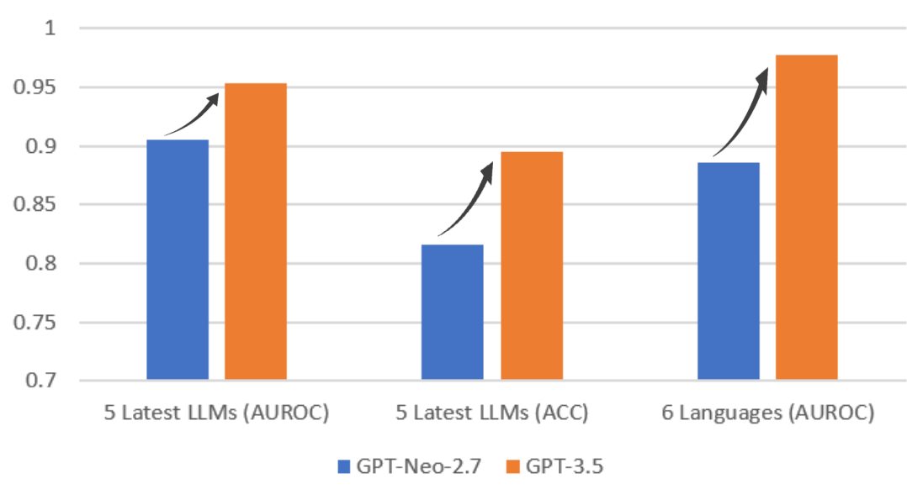

# Glimpse
**This code is for our ICLR 2025 paper "Glimpse: Enabling White-Box Methods to Use Proprietary Models for Zero-Shot LLM-Generated Text Detection"**, where we borrow some code from [Fast-DetectGPT](https://github.com/baoguangsheng/fast-detect-gpt).

[Paper](https://arxiv.org/abs/2412.11506)
| [LocalDemo](#local-demo)
| [OnlineDemo](https://aidetect.lab.westlake.edu.cn/)
| [OpenReview](https://openreview.net/forum?id=an3fugFA23)

* 9/4/2025: The demo server is facing a hardware problem, and we are actively working on a solution.
* 🔥 [4/14/2025] Free [API access](https://aidetect.lab.westlake.edu.cn/#/apidoc) to the detectors is ready! 
* 🔥 [2/10/2025] Local and online demos are ready! As OpenAI and AzureOpenAI have discontinued the legacy Completion API for GPT-3.5-turbo and GPT-4, our demo is limited to davinci and babbage models.

## Brief Intro
Glimpse serves as a bridge between white-box methods, which rely on local LLMs for scoring, and proprietary LLMs. It estimates full distributions based on partial observations from API-based models. Our empirical analysis demonstrates that detection methods leveraging these estimated distributions **achieve detection accuracies comparable to those obtained using real distributions**.

The main results are as follows, where Fast-DetectGPT using the proprietary GPT-3.5 achieves significantly better detection accuracies than that using open-source GPT-Neo-2.7B, **especially on multiple languages**.



## Local Demo
Run following command locally for an interactive demo:
```
python scripts/local_infer.py  --api_key <openai API key>  --scoring_model_name davinci-002 
```
An example looks like
```
Please enter your text: (Press Enter twice to start processing)
工作量和工作强度会根据银行的不同而有所不同。但一般来说，作为业务员需要在工作中需要面对各类客户，以及承担一定的工作压力和业绩指标，因此这个职业确实需要相当的努力和不断的自我提高。

Glimpse criterion is -0.3602, suggesting that the text has a probability of 69% to be machine-generated.
```

## Environment
* Python3.12
* Setup the environment:
  ```pip install -r requirements.txt```
  
(Notes: the baseline methods are run on 1 GPU of Tesla A100 with 80G memory, while Glimpse is run on a **CPU** environment.)

## Experiments
Following folders are created for our experiments:
* ./exp_main -> experiments with five latest LLMs as the source model (main.sh).
* ./exp_langs -> experiments on six languages (langs.sh).

(Notes: we share the data and results for convenient reproduction.)

### Citation
If you find this work useful, you can cite it with the following BibTex entry:

    @articles{bao2025glimpse,
      title={Glimpse: Enabling White-Box Methods to Use Proprietary Models for Zero-Shot LLM-Generated Text Detection},
      author={Bao, Guangsheng and Zhao, Yanbin and He, Juncai and Zhang, Yue},
      booktitle={The Thirteenth International Conference on Learning Representations},
      year={2025}
    }

